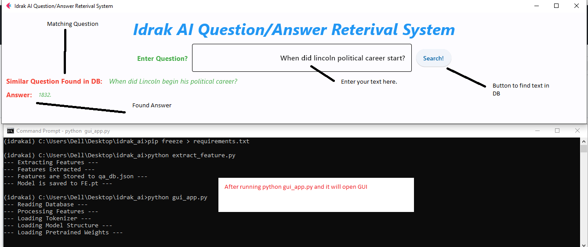

# idrak_ai_task
This repo contains the task assign by idark ai.

<video src='Idraak_Tutorial.mp4' width=180/>

## To extract features
```
python extract_feature.py
```
### Expected output
```
--- Extracting Features ---
--- Features Extracted ---
--- Features are Stored to qa_db.json ---
--- Model is saved to FE.pt ---

```

## Inference 
For inference we made a GUI based application. This application is developed in Flat. 
Flat is a python based module , which create flutter like applications.

```
python gui_app.py
```

It will run a flutter based application in which you will pass the question and it give us answers.


